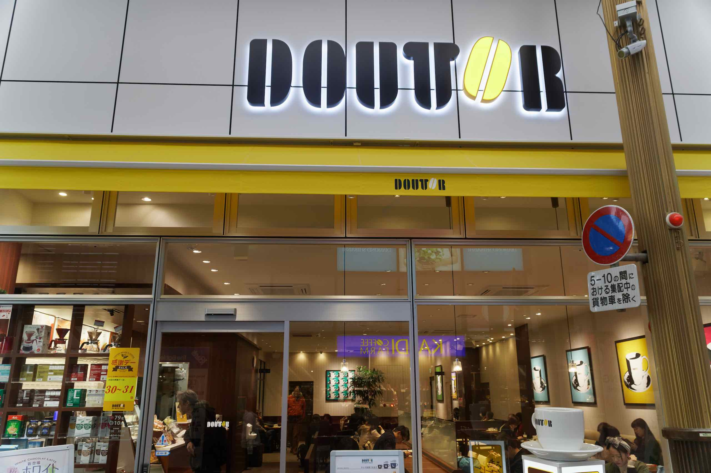

We also visited the Peace Museum, which was similar to the one in Hiroshima but on a smaller scale. I liked the animated reenactment of the bombing, and also the replica of the Fatman bomb that destroyed the area around the Mitsubishi Arms factory north of Nagasaki (but fortunately left most of the city centre intact).

We returned back to Shianbashi via streetcar No. 1 and had dinner at Doutour in Hamanomachi (two rolls &#8211; mine was prawn and avocado).

