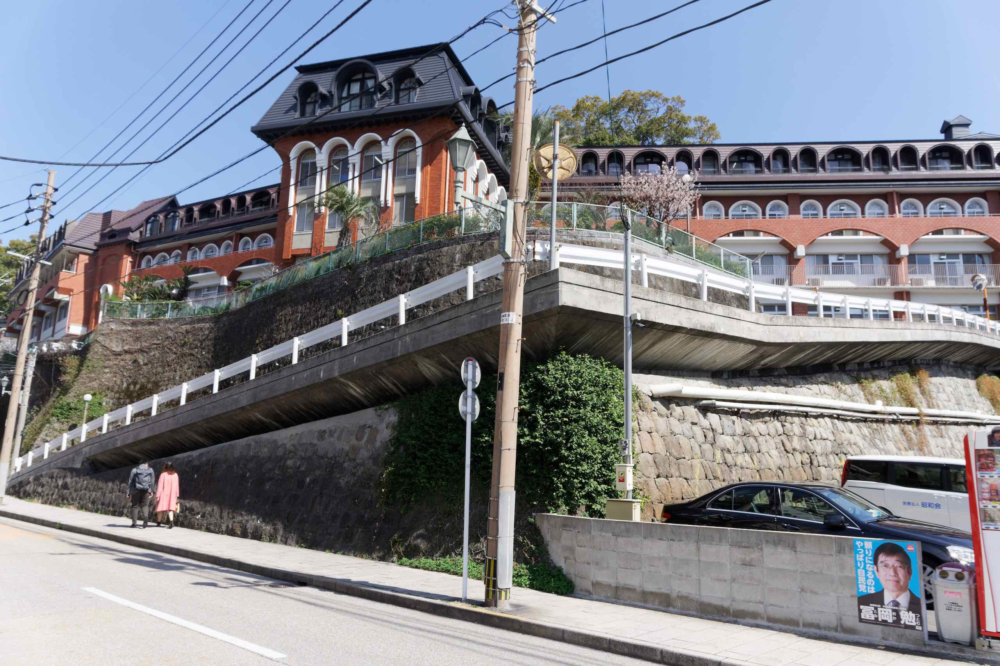

In addition to Glover Garden and the Dutch Slope, we also explored various places around Oura Machi and Minami Yamate-Machi. This included the former Hong Kong and Shanghai Bank Nagasaki Branch Building &#8211; an imposing three storey building with an imposing staircase and distinct Chinese architecture style &#8211; its&#8217; constructed in 1904.

Interesting buildings around the Glover Garden includes:

- the Inori-no-oka Picture Book Museum
  
- a &#8220;Penny and Dime&#8221; shop
  
- Glover&#8217;s House
  
- St. Kolbe&#8217;s (first house in Nagasaki)
  
- a magnificent Koban (police box).
  

We also visited the Oura Cathedral (although the church exterior was in restoration whilst we were there).

We had a quick look at the exterior of the Confucian Shrine but didn&#8217;t want to pay the admission fee.

We then passed through the interestingly shaped Showa Kai Hospital, as well as the former British Consulate building (now derelict).

We ended up in Chinatown where we had delicious saraudon at one of the oldest restaurants there, Kairakuen (会楽園).

