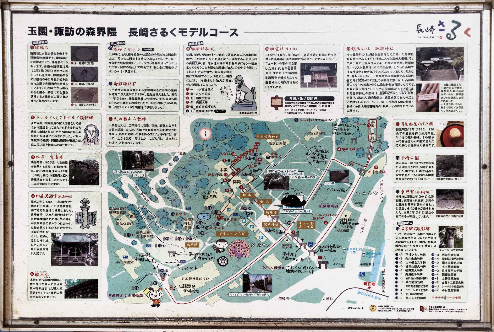

In the late afternoon, we caught a streetcar to Suwajinjamae and crossed the Nakashima River to visit Teramachi. The name literally means &#8220;Temple town&#8221; and it is a street full of &#8230; temples. Each temple is different, and the experience visiting all of them is almost overwhelming.

We took a stroll through Teramachi to admire the beautiful shrines and temples located there. Some were closed, and only one (Kokufuji) charged admission which we skipped as it was almost closing time.

For dinner we took the streetcar to Nagasaki station to the nearby Amu Plaza. I had a simple dish of seafood broth. After that we explored Tokyo Hands and headed back and had a quick stroll around the Shianbashi area before returning to the hotel to pack as we are checking out the following morning.
